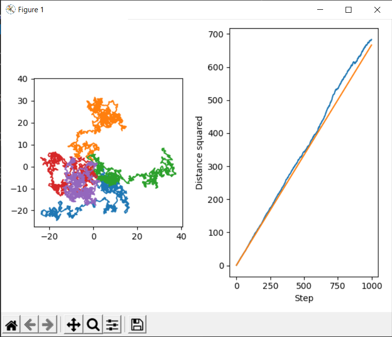
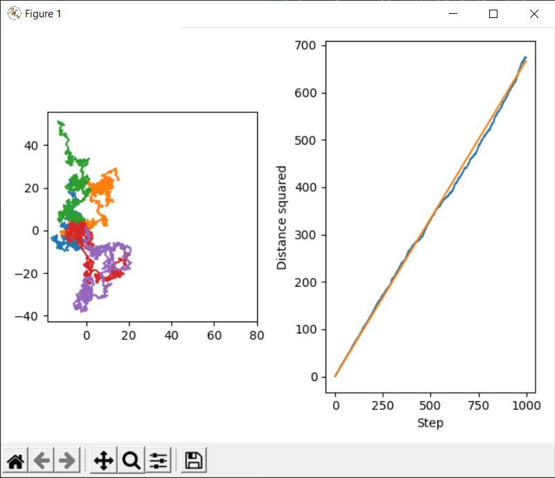
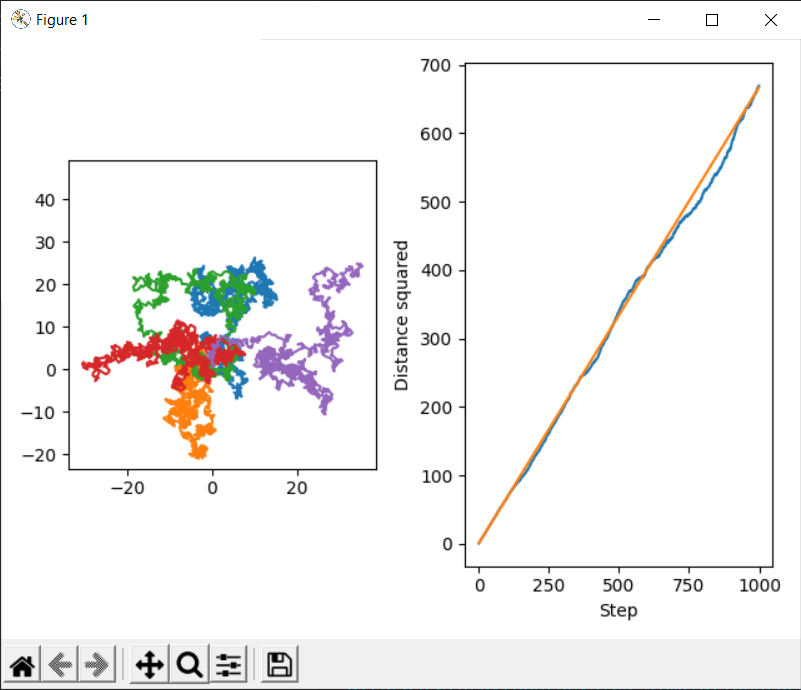

# Brownian motion simulation

A simulation of a random walk. At each step particle's coordinates are displaced by a random number uniformly distributed in [-1, 1].

Distance from the origin should be proportional to square root of number of steps, which is confirmed on graphs below.

To calculate those averages, 1000 random walks are generated and distance is averaged over them. First 5 of them are shown on the left graph.

